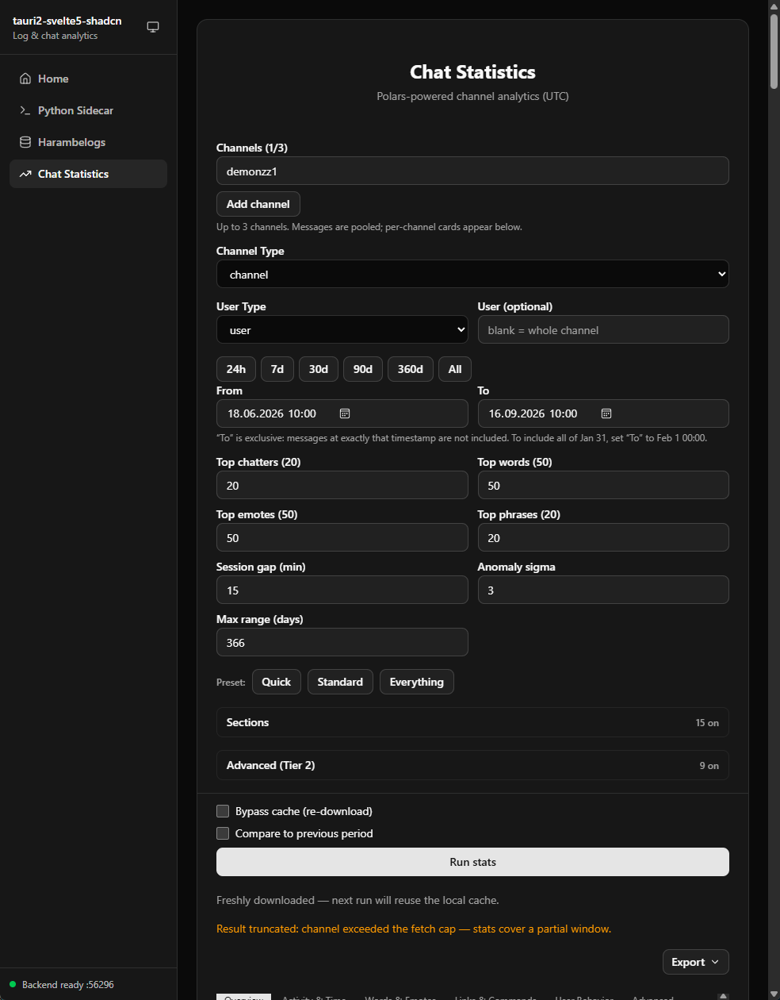
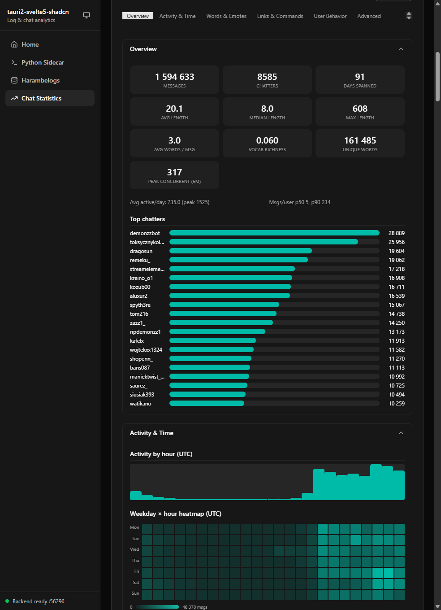
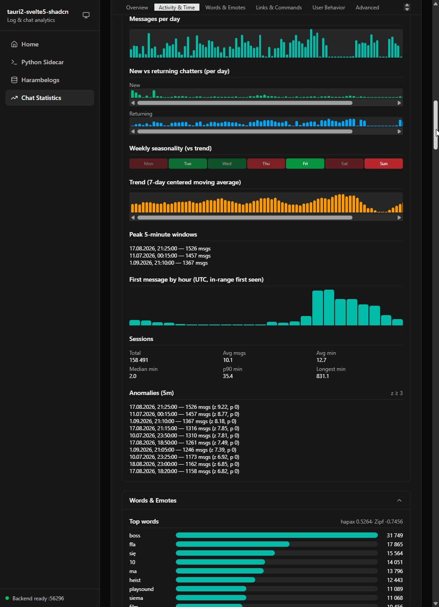
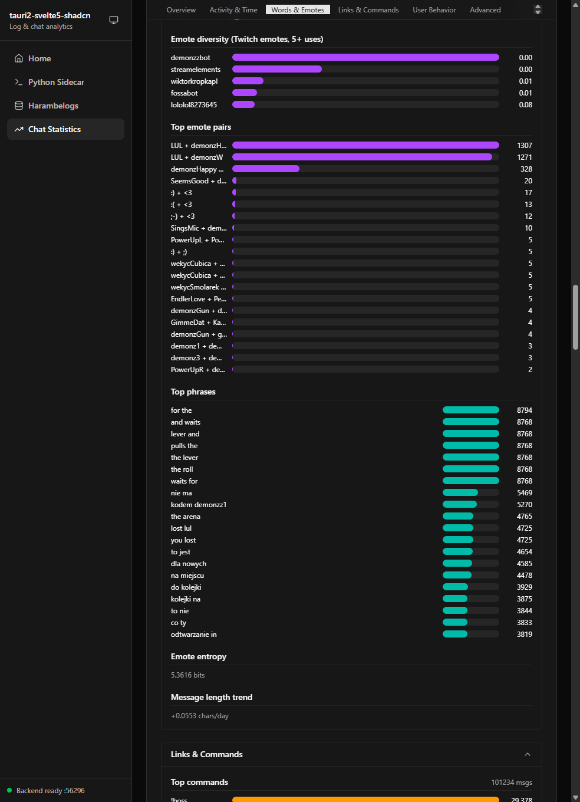
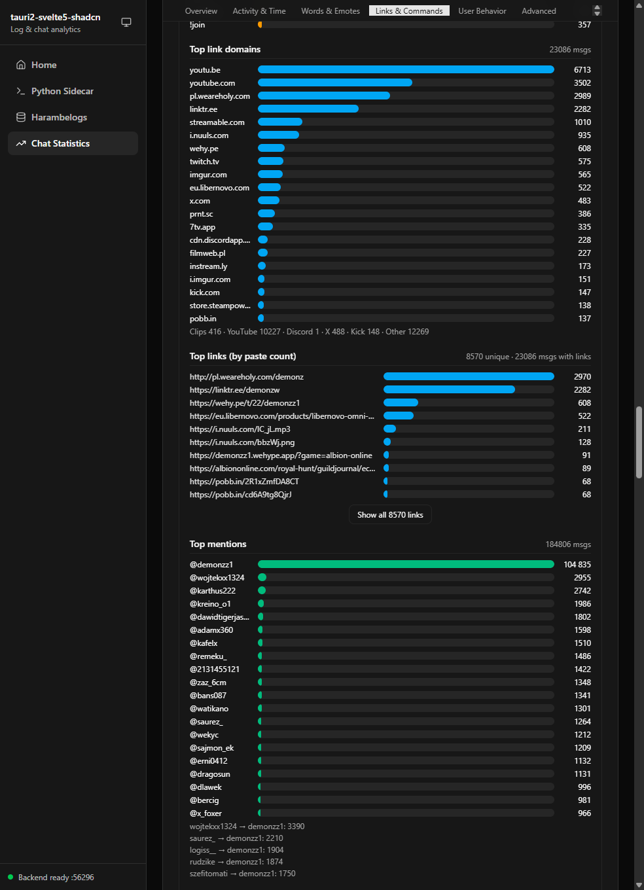
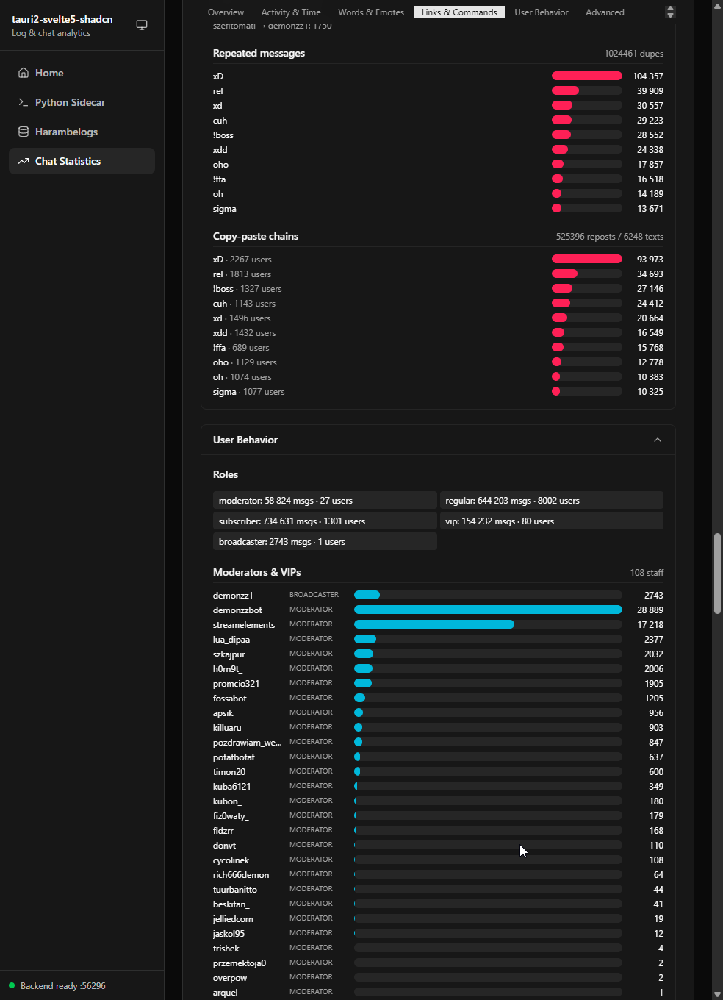
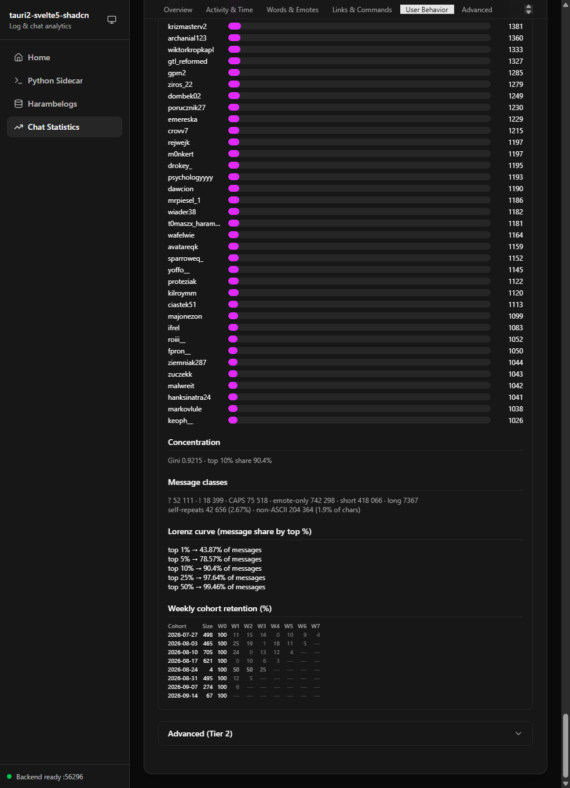

# Tauri 2 Svelte 5 Shadcn

Simple boilerplate for Tauri 2 with Svelte 5 (and shadcn-svelte).

## Screenshots

Chat statistics for a Twitch channel, computed locally by the Python sidecar.









## Requirements

- [Rust](https://www.rust-lang.org/tools/install) (stable toolchain)
- [Bun](https://bun.sh) (package manager & runtime)
- [uv](https://docs.astral.sh/uv/) (Python package manager)
- **Windows only:** MSVC Build Tools ("Desktop development with C++" workload, see https://visualstudio.microsoft.com/vs/community/)
- **Linux:** `sudo apt install libwebkit2gtk-4.1-dev build-essential curl wget file libxdo-dev libssl-dev libayatana-appindicator3-dev librsvg2-dev`

## Setup

1. Click the "Use this template" button on GitHub.
2. Clone your newly created repository:
   ```
   git clone https://github.com/YOUR_USERNAME/YOUR_REPOSITORY_NAME.git
   cd YOUR_REPOSITORY_NAME
   ```
3. Install dependencies:
   ```
   bun install
   ```

This template uses bun as its package manager. Keep `bun.lock` committed and use `bun install --frozen-lockfile` for reproducible installs in automation.

## Useful commands

### Start dev server

```
bun run tauri dev
```

### Build executable

```
bun run tauri build
```

### Add shadcn-svelte component

```
bunx shadcn-svelte@next add <component>
```

Replace `<component>` with the name of the component you want to add (e.g., button, card, dialog). You can find the full list of available components at https://next.shadcn-svelte.com/docs/components.

## Other links

### Svelte 5

https://svelte.dev/docs

### Tauri 2

https://tauri.app/start/

### shadcn-svelte

https://next.shadcn-svelte.com/

## Versioning

This project follows [Semantic Versioning 2.0.0](https://semver.org/). Incompatible changes to the template's documented APIs or integration patterns require a major release, backward-compatible capabilities use a minor release, and backward-compatible fixes use a patch release.

## License

This project is licensed under the MIT License - see the [LICENSE](LICENSE) file for details.
